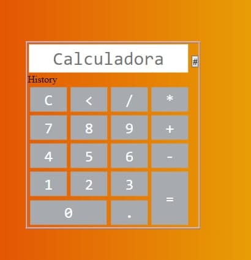

Haga una calculadora con HTML5 , JavaScript (ES5) adornada con CSS3, la cual
debe hacer las operaciones básicas de suma, resta, multiplicación y división la cual
almacene un historial de los cálculos hechos hasta que el usuario decida eliminarlos.
Utilice la funcionalidad de localStorage para guardar el historial de las operaciones
realizadas.

<<<<<<< HEAD

=======

>>>>>>> 04f535937c9edae2418676f7214fdf1a270d27bb